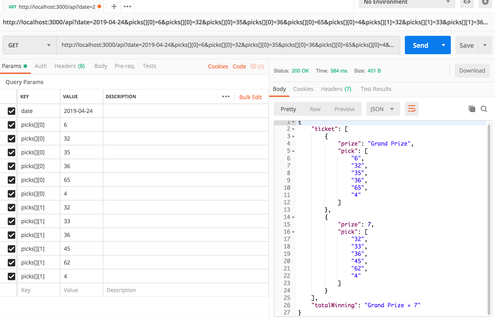

## Project Overview
This is a back end API for checking US Powerball Ticket. This API will accept ticket information and compare with Powerball Public API, verify your ticket info and provide the detail of winning result

## For Developer
 API endpoint
  * Developer can send GET request to the below public endpoint to aquire data
  ```
  localhost:3000/api
  ```
 REQUEST data structure and sample
  * GET data should have a query param of `date`, in the format of `YYYY-MM-DD` which indicates the draw date
  * GET data should have a query param of `picks`, which is an array of pick, each pick should be an array of 6 numbers (5 white balls and 6th is Powerball) following the Powerball number rules. (eg: You should not include number such as 101)
  * Use the following GET data as reference
  ```
  http://localhost:3000/api?picks[][0]=3&picks[][0]=35&picks[][0]=36&picks[][0]=65&picks[][0]=4&picks[][1]=32&picks[][1]=33&picks[][1]=36&picks[][1]=45&picks[][1]=62&picks[][1]=4&date=2019-04-24&picks[][0]=19
  ``` 
### Sample Code
  * Request Via jQuery
  ```javascript
  var settings = {
    "async": true,
    "crossDomain": true,
    "url": "http://localhost:3000/api?date=2019-04-24&picks[][0]=6,32,35,36,65,4&picks[][1]=32,33,36,45,62,4",
    "method": "GET",
  }

  $.ajax(settings).done(function (response) {
    console.log(response);
  });
  ```

  * Request Via Python
  ```python
  import requests
  url = "http://localhost:3000/api"
  querystring = {"date":"2019-04-24","picks[][0]":["6","32","35","36","65","4"],"picks[][1]":["32","33","36","45","62","4"]}
  headers = {
      'Content-Type': "application/x-www-form-urlencoded",
      'Accept': "*/*",
      'Cache-Control': "no-cache",
      'Postman-Token': "80829e16-695a-4803-8f1c-549f658311d0,afe2b3b4-63a4-41f1-a5a4-16402b6ba4d9",
      'Host': "localhost:3000",
      'accept-encoding': "gzip, deflate",
      'Connection': "keep-alive",
      'cache-control': "no-cache"
      }
  response = requests.request("GET", url, headers=headers, params=querystring)

  print(response.text))
  ```

  * Request Via Nodejs
  ```javascript
  var request = require("request");
  var options = { method: 'GET',
    url: 'http://localhost:3000/api',
    qs:
    { date: '2019-04-24',
      picks: [
        [ '6', '32', '35', '36', '65', '4' ],
        [ '32', '33', '36', '45', '62', '4' ]
      ],
      headers:
      { 'cache-control': 'no-cache',
        Connection: 'keep-alive',
        'accept-encoding': 'gzip, deflate',
        Host: 'localhost:3000',
        Accept: '*/*',
        'User-Agent': 'PostmanRuntime/7.11.0',
        'Content-Type': 'application/x-www-form-urlencoded' }
      }};

  request(options, function (error, response, body) {
    if (error) throw new Error(error);

    console.log(body);
  });
  ```
 Expected Response from API
  * If valid ticket information is provided, server will respond with a JSON about whether each pick has won, the prize won per-pick, and the total of all prizes won on the ticket
  * Sample Success Response as follow:
  ```json
  {
    "ticket": [
        {
            "prize": false,
            "pick": [ 5, 6, 7, 8, 9, 10 ]
        },
        {
            "prize": "Grand Prize",
            "pick": [ 6, 32, 35, 36, 65, 4 ]
        },
        {
            "prize": 7,
            "pick": [ 32, 33, 36, 45, 62, 4 ]
        }
    ],
    "totalWinning": "Grand Prize + 7"
  }
  ```

  

## Live Demo

* When sending a successful request, server response with status 200 and winning information


* When sending request with incorrect picks, such as sending something different then array, sever response with status 400 and corresponding message


* When sending request with invalid date type, server response with status 400 and corresponding message


* When requested date does not have a draw, server response with status 400 and message showing that the draw date indicated on ticket is incorrect


* A sample live preview has been provided. Please note that this sample UI is NOT dynamic and is NOT designed for real time use. GET data cannot be changed. This page is ONLY for demonstration purpose of how the backend API work


## Prerequiste
This app requires: 

- A Linux or MacOS Environment *(Windows Untested)*
- Node.js LTS 10.9+

## How To Use
Fork and Clone this repository to your local machine

From the checked-out application folder, run: 

`npm install`

This will install dependencies.

`npm start`

You should see output like this: 

```
node index.js
App listening on port 3000
```

To check out sample HTML demo, visit `localhost:3000/sample`. Note that sample page is NOT for production use. GET data cannot be changed. This is only for demo purpose


To use this API, send GET request with the data format mention above to:
```
localhost:3000/api
```

## Testing

To run the existing (sample) tests simply use: 

`npm test`

You should see output like this: 

```
 Test Suites: 3 passed, 3 total
 Tests:       9 passed, 9 total
 Snapshots:   0 total
 Time:        2.585s
 Ran all test suites. 
```


